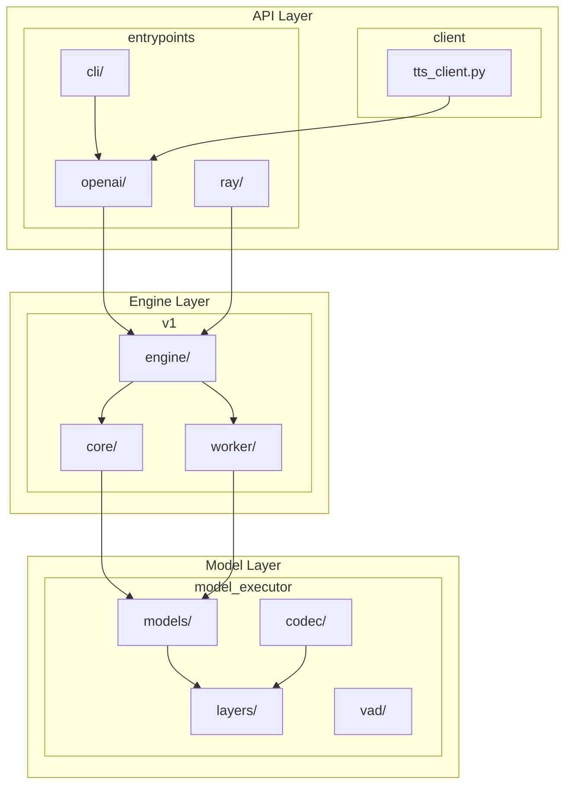
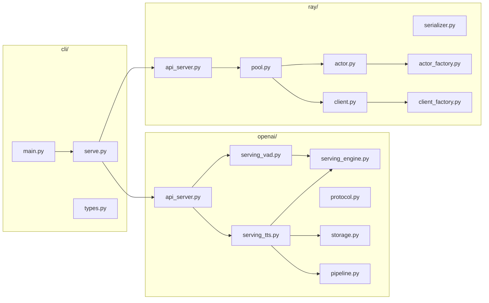
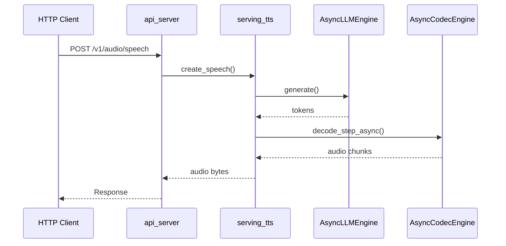

# Entrypoints Module

> External interface module for nano-vllm providing CLI, OpenAI-compatible API, and Ray distributed inference.

---

## Table of Contents

- [Project Structure](#project-structure)
- [Entrypoints Detail](#entrypoints-detail)
- [Request Flow](#request-flow)
- [Module Description](#module-description)
- [API Reference](#api-reference)
  - [Endpoints Overview](#endpoints-overview)
  - [HTTP Response Codes](#http-response-codes)
  - [Endpoint Schemas](#endpoint-schemas)
- [NPZ Voice Clone Workflow](#npz-voice-clone-workflow)

---

## Project Structure



---

## Entrypoints Detail



---

## Request Flow



---

## Module Description

### CLI Module (`cli/`)

| File | Description |
|:-----|:------------|
| `main.py` | CLI entrypoint |
| `serve.py` | `dobby serve` command implementation |
| `types.py` | CLI interface definitions |

### OpenAI Module (`openai/`)

| File | Description |
|:-----|:------------|
| `api_server.py` | FastAPI router and endpoint definitions |
| `serving_tts.py` | TTS generation and voice cloning logic |
| `serving_vad.py` | Voice Activity Detection service |
| `protocol.py` | Pydantic request/response models |
| `storage.py` | Voice file storage management |
| `pipeline.py` | Audio processing pipeline |

### Ray Module (`ray/`)

| File | Description |
|:-----|:------------|
| `pool.py` | Actor pool management |
| `actor.py` | Ray actor definitions |
| `client.py` | Actor pool client interface |
| `serializer.py` | Serialization utilities |
| `actor_factory.py` | Actor creation factory |
| `client_factory.py` | Client creation factory |

---

## API Reference

### Endpoints Overview

| Endpoint | Method | Description |
|:---------|:------:|:------------|
| `/health` | `GET` | Health check |
| `/v1/models` | `GET` | List available models |
| `/v1/audio/voice-clone` | `POST` | Register voice clone (batch), supports `response_format=npz` |
| `/v1/audio/voice-clone-from-codes` | `POST` | Create voice from codes (JSON) or NPZ file upload |
| `/v1/audio/voices` | `GET` | List registered voices |
| `/v1/audio/voices/{id}` | `DELETE` | Delete voice clone |
| `/v1/audio/voices` | `DELETE` | Delete all voice clones |
| `/v1/audio/voices/{id}/audio` | `GET` | Download voice audio file |
| `/v1/audio/speech` | `POST` | Generate speech from text |
| `/v1/audio/speech/with_streaming_response` | `POST` | Generate speech (PCM streaming) |
| `/v1/audio/speech/decode-non-stream` | `POST` | Decode audio codes to audio |
| `/v1/audio/vad` | `POST` | Voice Activity Detection |
| `/v1/audio/vad/collect` | `POST` | Collect speech from multiple audio files |

### HTTP Response Codes

| Code | Error Type | Description |
|:----:|:-----------|:------------|
| `200` | - | Success |
| `400` | `invalid_request_error` | Invalid request parameters |
| `404` | `not_found_error` | Resource not found (voice, model) |
| `422` | `unprocessable_entity_error` | Semantic validation failed |
| `429` | `rate_limit_error` | Engine overloaded |
| `499` | - | Client cancelled request |
| `500` | `internal_error` | Internal server error |
| `500` | `generation_error` | TTS generation failed |
| `500` | `codec_error` | Audio codec failed |
| `503` | `service_unavailable` | Service temporarily unavailable |
| `503` | `engine_dead` | Engine died (unrecoverable) |

---

## Endpoint Schemas

### GET `/health`

Health check endpoint.

**Request:**
```bash
curl http://localhost:8000/health
```

**Response:**
```json
{
  "status": "healthy"
}
```

---

### GET `/v1/models`

List available TTS models.

**Request:**
```bash
curl http://localhost:8000/v1/models
```

**Response:**
```json
{
  "object": "list",
  "data": [
    {
      "id": "dobby-tts-v1",
      "object": "model",
      "created": 1703318400,
      "owned_by": "dobby-nano-vllm",
      "root": null,
      "parent": null,
      "max_model_len": null,
      "permission": []
    }
  ]
}
```

---

### POST `/v1/audio/voice-clone`

Register voice clones from audio files. Supports batch processing (JSON) or single voice NPZ export.

<details>
<summary><strong>Example: JSON Response (Batch)</strong></summary>

```bash
curl -X POST http://localhost:8000/v1/audio/voice-clone \
  -H "Content-Type: application/json" \
  -d '{
    "voices": [{
      "prompt_audio": "<base64_encoded_audio>",
      "prompt_text": "참조 텍스트입니다.",
      "voice_id": "my-voice"
    }]
  }'
```

</details>

<details>
<summary><strong>Example: NPZ Response (Single Voice)</strong></summary>

```bash
curl -X POST http://localhost:8000/v1/audio/voice-clone \
  -H "Content-Type: application/json" \
  -d '{
    "voices": [{
      "prompt_audio": "<base64_encoded_audio>",
      "prompt_text": "참조 텍스트입니다.",
      "voice_id": "my-voice"
    }],
    "response_format": "npz"
  }' \
  --output voice.npz
```

</details>

#### Request Body

```json
{
  "voices": [
    {
      "prompt_audio": "<base64_encoded_audio>",
      "prompt_text": "참조 텍스트입니다.",
      "voice_id": "custom-voice-1"
    }
  ],
  "response_format": "json"
}
```

#### Parameters

| Field | Type | Required | Default | Description |
|:------|:----:|:--------:|:-------:|:------------|
| `voices` | array | Yes | - | List of voice configs |
| `voices[].prompt_audio` | string | Yes | - | Base64-encoded reference audio |
| `voices[].prompt_text` | string | No | `""` | Transcript of reference audio |
| `voices[].voice_id` | string | No | auto | Custom voice ID |
| `response_format` | enum | No | `"json"` | `json` (batch) or `npz` (single) |

#### Response (JSON)

```json
{
  "voice_ids": ["custom-voice-1", "a1b2c3d4-..."],
  "successful": 2,
  "failed": 0,
  "total_time_ms": 1234.56
}
```

#### Response (NPZ)

Binary `.npz` file containing:

| Key | Type | Description |
|:----|:-----|:------------|
| `voice_id` | string | Voice identifier |
| `prompt_audio_codes` | array | Audio codes `[num_codebooks, num_frames]` |
| `prompt_audio_codes_mask` | array | Validity mask `[num_frames]` |
| `prompt_text` | string | Reference text |

---

### POST `/v1/audio/voice-clone-from-codes`

Create a voice clone from pre-encoded audio codes. Supports JSON and NPZ file upload.

#### Option 1: JSON Request

```bash
curl -X POST http://localhost:8000/v1/audio/voice-clone-from-codes \
  -H "Content-Type: application/json" \
  -d '{
    "prompt_audio_codes": [[24, 75, 89], [12, 45, 67]],
    "prompt_text": "참조 텍스트입니다.",
    "voice_id": "my-voice"
  }'
```

| Field | Type | Required | Default | Description |
|:------|:----:|:--------:|:-------:|:------------|
| `prompt_audio_codes` | array | Yes | - | Audio codes `[num_codebooks, num_frames]` |
| `prompt_text` | string | No | `""` | Text corresponding to prompt audio |
| `voice_id` | string | No | auto | Custom voice ID |

#### Option 2: NPZ File Upload

```bash
curl -X POST http://localhost:8000/v1/audio/voice-clone-from-codes \
  -F "file=@voice_clone.npz"
```

**Required NPZ fields:**
- `voice_id` - Voice identifier string
- `prompt_audio_codes` - Audio codes array `[num_codebooks, num_frames]`
- `prompt_audio_codes_mask` - Validity mask array `[num_frames]`
- `prompt_text` (optional) - Reference text string

#### Response

```json
{
  "voice_id": "custom-voice-1",
  "status": "created"
}
```

---

### GET `/v1/audio/voices`

List all registered voices.

**Request:**
```bash
curl http://localhost:8000/v1/audio/voices
```

**Response:**
```json
{
  "object": "list",
  "data": [
    {
      "voice_id": "default",
      "prompt_text": "...",
      "created_at": "2024-12-23T10:00:00Z"
    },
    {
      "voice_id": "custom-voice-1",
      "prompt_text": "...",
      "created_at": "2024-12-23T11:00:00Z"
    }
  ]
}
```

---

### DELETE `/v1/audio/voices/{voice_id}`

Delete a specific voice clone.

**Request:**
```bash
curl -X DELETE http://localhost:8000/v1/audio/voices/my-voice
```

**Response:**
```json
{
  "status": "deleted",
  "voice_id": "my-voice"
}
```

---

### DELETE `/v1/audio/voices`

Delete all voice clones.

**Request:**
```bash
curl -X DELETE http://localhost:8000/v1/audio/voices
```

**Response:**
```json
{
  "status": "deleted"
}
```

---

### GET `/v1/audio/voices/{voice_id}/audio`

Download the original reference audio for a voice clone.

**Request:**
```bash
curl http://localhost:8000/v1/audio/voices/my-voice/audio --output voice.wav
```

**Response:** Binary audio file (original reference audio)

---

### POST `/v1/audio/speech`

Generate speech from text. Supports JSON body and NPZ binary input.

<details>
<summary><strong>Example: Basic Usage</strong></summary>

```bash
curl -X POST http://localhost:8000/v1/audio/speech \
  -H "Content-Type: application/json" \
  -d '{"input_text": "안녕하세요, 반갑습니다."}' \
  --output output.mp3
```

</details>

<details>
<summary><strong>Example: With Voice Clone</strong></summary>

```bash
curl -X POST http://localhost:8000/v1/audio/speech \
  -H "Content-Type: application/json" \
  -d '{
    "input_text": "안녕하세요, 반갑습니다.",
    "voice_id": "my-voice",
    "response_format": "pcm"
  }' \
  --output output.pcm
```

</details>

<details>
<summary><strong>Example: NPZ Input (multipart/form-data)</strong></summary>

```bash
curl -X POST http://localhost:8000/v1/audio/speech \
  -F "file=@voice_clone.npz" \
  -F "input_text=안녕하세요, 반갑습니다." \
  --output output.mp3
```

</details>

#### Request Body (JSON)

```json
{
  "input_text": "안녕하세요, 반갑습니다.",
  "voice_id": "default",
  "model": "dobby-tts-v1",
  "response_format": "pcm",
  "speed": 1.0,
  "do_sample": true,
  "temperature": 0.5,
  "top_p": 0.75,
  "top_k": 25,
  "repetition_penalty": 1.3,
  "max_tokens": 1024,
  "depth_do_sample": true,
  "depth_temperature": 0.7,
  "depth_top_k": 25,
  "depth_top_p": 0.75,
  "bitrate": "192k",
  "prompt_audio": null,
  "prompt_text": null,
  "request_id": null
}
```

#### Parameters

| Field | Type | Required | Default | Description |
|:------|:----:|:--------:|:-------:|:------------|
| `input_text` | string | Yes | - | Text to synthesize |
| `input` | string | No | - | Alias for `input_text` (OpenAI compat) |
| `voice_id` | string | No | `"default"` | Voice identifier |
| `model` | string | No | server default | TTS model identifier |
| `response_format` | enum | No | `"pcm"` | `mp3`, `opus`, `aac`, `flac`, `wav`, `pcm` |
| `speed` | float | No | `1.0` | Speech speed (0.25–4.0) |
| `do_sample` | bool | No | `true` | Stochastic sampling (false = greedy) |
| `temperature` | float | No | `0.5` | Sampling temperature |
| `top_p` | float | No | `0.75` | Nucleus sampling threshold |
| `top_k` | int | No | `25` | Top-k sampling |
| `repetition_penalty` | float | No | `1.3` | Repetition penalty |
| `max_tokens` | int | No | `1024` | Maximum audio frames |
| `depth_do_sample` | bool | No | `null` | Enable depth decoder sampling |
| `depth_temperature` | float | No | `0.7` | Depth decoder temperature |
| `depth_top_k` | int | No | `25` | Depth decoder top-k |
| `depth_top_p` | float | No | `0.75` | Depth decoder top-p |
| `bitrate` | enum | No | `"192k"` | `64k`, `128k`, `192k`, `256k`, `320k` |
| `prompt_audio` | string | No | `null` | Base64-encoded reference audio |
| `prompt_text` | string | No | `null` | Reference text for cloning |
| `request_id` | string | No | auto | Request tracking ID |

#### Response

Binary audio file with Content-Type based on `response_format`.

---

### POST `/v1/audio/speech/with_streaming_response`

Streaming endpoint returning audio chunks as they are generated.

```bash
curl -X POST http://localhost:8000/v1/audio/speech/with_streaming_response \
  -H "Content-Type: application/json" \
  -d '{"input_text": "안녕하세요, 반갑습니다."}' \
  --output output.pcm
```

**Request:** Same schema as `/v1/audio/speech`

**Response:** Binary PCM Audio Stream (Chunked Transfer Encoding)

> **Note:** This endpoint forces `response_format="pcm"` to ensure gapless playback. Other formats are not supported in streaming mode.

---

### POST `/v1/audio/speech/decode-non-stream`

Decode audio codes to audio file.

**Request:**
```bash
curl -X POST http://localhost:8000/v1/audio/speech/decode-non-stream \
  -H "Content-Type: application/json" \
  -d '{
    "codes": [[[24, 75, 89], [12, 45, 67]]],
    "format": "mp3"
  }'
```

#### Parameters

| Field | Type | Required | Default | Description |
|:------|:----:|:--------:|:-------:|:------------|
| `codes` | array | Yes | - | Batch of audio codes `[batch, num_codebooks, T]` |
| `format` | enum | No | `"mp3"` | Output format: `mp3`, `wav` |

#### Response

```json
{
  "audio": ["<base64_encoded_audio>", ...],
  "format": "mp3"
}
```

---

### POST `/v1/audio/vad`

Detect speech segments in audio. All time values are in milliseconds.

**Request:**
```bash
curl -X POST http://localhost:8000/v1/audio/vad \
  -H "Content-Type: application/json" \
  -d '{
    "audio": "<base64_encoded_audio>",
    "threshold": 0.5
  }'
```

#### Parameters

| Field | Type | Required | Default | Description |
|:------|:----:|:--------:|:-------:|:------------|
| `audio` | string | Yes | - | Base64-encoded audio |
| `threshold` | float | No | `0.5` | Speech detection threshold (0.0-1.0) |
| `min_speech_duration` | int | No | `0` | Minimum speech segment (ms) |
| `min_silence_duration` | int | No | `160` | Minimum silence to end segment (ms) |
| `max_speech_duration` | int | No | `20000` | Maximum single segment (ms) |
| `speech_pad` | int | No | `400` | Padding for each segment (ms) |

#### Response

```json
{
  "results": [
    {"start": 500, "end": 2300},
    {"start": 4100, "end": 6800}
  ],
  "total_duration": 10000,
  "speech_duration": 4500,
  "time_unit": "ms"
}
```

---

### POST `/v1/audio/vad/collect`

Collect speech from multiple audio files up to a target duration. All time values are in milliseconds.

**Request:**
```bash
curl -X POST http://localhost:8000/v1/audio/vad/collect \
  -H "Content-Type: application/json" \
  -d '{
    "audios": ["<base64_audio_1>", "<base64_audio_2>"],
    "max_duration": 30000,
    "output_format": "mp3"
  }'
```

#### Parameters

| Field | Type | Required | Default | Description |
|:------|:----:|:--------:|:-------:|:------------|
| `audios` | array | Yes | - | List of base64-encoded audio files |
| `max_duration` | int | No | `30000` | Maximum output duration (ms) |
| `max_speech_duration` | int | No | `20000` | Maximum single segment (ms) |
| `threshold` | float | No | `0.5` | Speech detection threshold (0.0-1.0) |
| `min_speech_duration` | int | No | `0` | Minimum speech segment (ms) |
| `min_silence_duration` | int | No | `160` | Minimum silence to end segment (ms) |
| `speech_pad` | int | No | `400` | Padding for each segment (ms) |
| `output_sample_rate` | int | No | `24000` | Output sample rate (8000-48000 Hz) |
| `output_format` | string | No | `mp3` | Output format: `mp3`, `wav`, `ogg`, `flac` |

#### Response

```json
{
  "audio": "<base64_audio>",
  "duration": 25000,
  "segments_count": 5
}
```

---

## NPZ Voice Clone Workflow

NPZ format enables efficient voice clone transfer between servers without re-encoding audio.

### NPZ File Structure

```
voice_clone.npz
├── voice_id                # string: Voice identifier
├── prompt_audio_codes      # array [num_codebooks, T]: Pre-encoded audio codes
├── prompt_audio_codes_mask # array [T]: Validity mask (1=valid, 0=invalid)
└── prompt_text             # string: Reference text (optional)
```

### Workflow Example

#### Step 1: Create Voice Clone and Download as NPZ

```bash
curl -X POST http://server-a:8000/v1/audio/voice-clone \
  -H "Content-Type: application/json" \
  -d '{
    "voices": [{
      "prompt_audio": "<base64_audio>",
      "prompt_text": "참조 텍스트",
      "voice_id": "my-voice"
    }],
    "response_format": "npz"
  }' \
  --output my-voice.npz
```

#### Step 2: Upload NPZ to Another Server

```bash
curl -X POST http://server-b:8000/v1/audio/voice-clone-from-codes \
  -F "file=@my-voice.npz"
```

#### Step 3: Use the Voice for TTS

```bash
curl -X POST http://server-b:8000/v1/audio/speech \
  -H "Content-Type: application/json" \
  -d '{"input_text": "안녕하세요", "voice_id": "my-voice"}' \
  --output output.mp3
```

### Benefits

| Benefit | Description |
|:--------|:------------|
| **No re-encoding** | Skip audio→codes conversion on destination server |
| **Smaller payload** | Codes are more compact than raw audio |
| **Portable** | Transfer voices between servers/environments |
