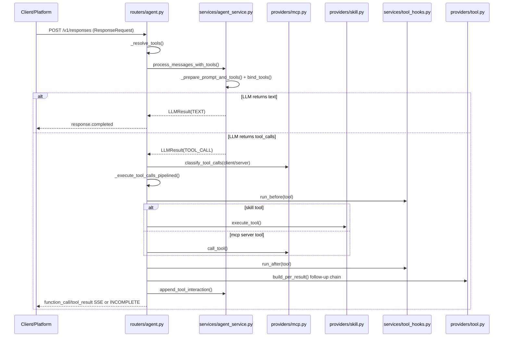
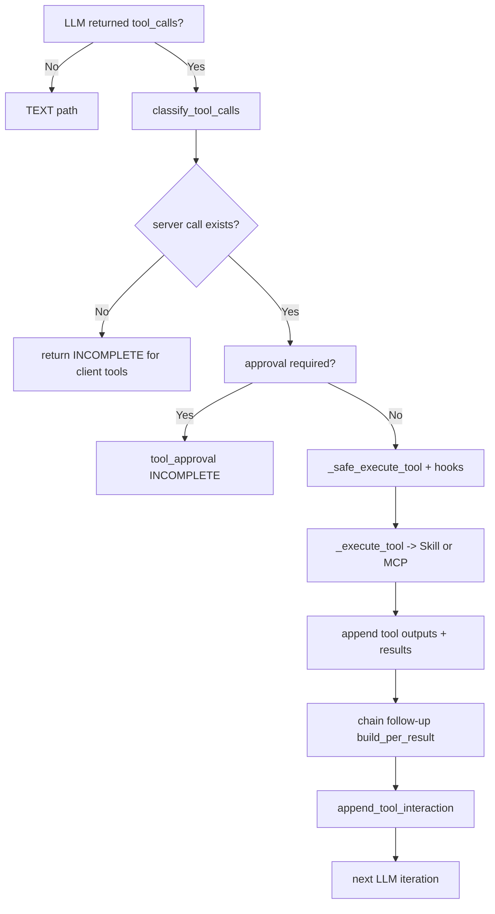

# Tool Call Flow Summary (Heureum Agent)

이 문서는 `heureum-agent` 내부에서 **툴 호출(tool call)** 이 생성되고 실행되며, 결과가 다시 루프에 반영되는 과정을 코드 기준으로 정리합니다.

---

## 1) 한눈에 보는 전체 흐름



---

## 2) 진입점과 루프 오케스트레이션

핵심 진입점은 `create_response()` 입니다.

```python
# app/routers/agent.py
@router.post("/responses", response_model=ResponseObject)
async def create_response(request: ResponseRequest) -> ResponseObject:
    await _ensure_initialized()
    ...
    (
        tool_names,
        client_tool_schemas,
        client_tool_names,
        client_tool_prompts,
        display_names,
    ) = _resolve_tools(request)
    ...
    ctx = _LoopContext(...)

    if request.stream:
        runner = _AgentLoopRunner(ctx)
        return StreamingResponse(runner.stream(), media_type="text/event-stream", headers=_SSE_HEADERS)

    return await _AgentLoopRunner(ctx).run()
```

- `request.tools`(클라이언트 제공 툴) + MCP discovery 툴 + Skill 툴을 합쳐 루프 컨텍스트를 만듭니다.
- 스트리밍이면 `_AgentLoopRunner.stream()`, 비스트리밍이면 `_AgentLoopRunner.run()` 경로로 들어갑니다.

---

## 3) 툴 스키마 결합(LLM 바인딩 전)

LLM에 실제로 바인딩되는 스키마는 `AgentService._prepare_prompt_and_tools()`에서 조합됩니다.

```python
# app/services/agent_service.py
def _prepare_prompt_and_tools(...):
    if self.skill_provider:
        server_tool_prompts = self.skill_provider.get_all_guide_prompts()
        server_tool_schemas = self.skill_provider.get_all_tool_schemas()
    else:
        server_tool_prompts = []
        server_tool_schemas = []

    prompt = build_system_prompt(...)

    tools = list(client_tool_schemas or [])
    tools.extend(server_tool_schemas)
    if self.mcp_tools:
        tools.extend(self.mcp_tools)

    return prompt, tools
```

그리고 실제 호출 시 `bind_tools()`가 적용됩니다.

```python
async def _call_llm(self, lc_messages: list, tools: list):
    if tools:
        return await self.llm.bind_tools(tools).ainvoke(lc_messages)
    return await self.llm.ainvoke(lc_messages)
```

---

## 4) LLM 결과가 tool_call일 때 분기

```python
# app/services/agent_service.py
if response.tool_calls:
    return LLMResult(
        type=LLMResultType.TOOL_CALL,
        tool_calls=[
            ToolCallInfo(name=tc["name"], args=tc["args"], id=tc["id"])
            for tc in response.tool_calls
        ],
        assistant_lc_message=response,
        session_id=session_id,
        usage=usage,
    )
```

라우터 쪽에서는 `_handle_tool_call_iteration()`이 핵심입니다.

```python
# app/routers/agent.py
client_calls, server_calls = mcp_client.classify_tool_calls(
    all_tool_calls,
    self.ctx.session_id,
    client_tool_names=self.ctx.client_tool_names,
)
```

- `client_calls`: 프론트/클라이언트가 실행해야 하는 툴
- `server_calls`: 서버에서 직접 실행(MCP/Skill)하는 툴

---

## 5) 서버 툴 실행 디스패치

툴 이름으로 Skill/MCP를 분기합니다.

```python
# app/routers/agent.py
async def _execute_tool(name: str, arguments: Dict[str, Any], session_id: str = "", cwd: str = "") -> str:
    if skill_provider.get_skill_for_tool(name) is not None:
        return await skill_provider.execute_tool(name, arguments, session_id)

    if mcp_client.is_server_tool(name):
        return await mcp_client.call_tool(name, arguments, session_id=session_id, cwd=cwd)

    return f"Error: Tool '{name}' is no longer available."
```

MCP 실제 호출:

```python
# app/services/providers/mcp.py
result = await session.call_tool(name, arguments, meta=meta)
return self._extract_text(result)
```

---

## 6) Hook 적용(before/after)

모든 서버 툴 실행은 `_safe_execute_tool()`을 경유하며 hook이 적용됩니다.

```python
# app/routers/agent.py
hook_result = await hook_runner.run_before(tc.name, tc.args, context)
if hook_result.blocked:
    return tc, f"Error: Tool blocked: {hook_result.reason}"

result = await _execute_tool(tc.name, params, session_id=session_id, cwd=cwd)
await hook_runner.run_after(tc.name, params, result, None, context)
```

등록된 기본 hook:

```python
# app/services/tool_hooks.py
hook_runner = ToolHookRunner()
hook_runner.register(LoopDetectionHook())
hook_runner.register(MutationTrackingHook())
hook_runner.register(TimingHook())
```

의미:
- `LoopDetectionHook`: 반복 루프 탐지/차단
- `MutationTrackingHook`: 변경성 도구 호출 로깅
- `TimingHook`: 느린 툴 측정

---

## 7) 파이프라인 실행 + 체인 후속 호출

툴은 병렬 실행되며, 완료 즉시 체인 후속(step)을 이어갑니다.

```python
# app/routers/agent.py
pipeline_results, deferred_approval = await _execute_tool_calls_pipelined(
    server_calls,
    self.ctx.output_items,
    session_id=self.ctx.session_id,
    cwd=self.ctx.cwd,
)
```

파이프라인 내부:

```python
# app/routers/agent.py
done, _ = await asyncio.wait(pending.keys(), return_when=asyncio.FIRST_COMPLETED)
...
follow_ups = chain_registry.build_per_result(tc_done, msg, session_id=session_id)
for fu in follow_ups:
    pending[asyncio.create_task(_safe_execute_tool(fu, session_id=session_id, cwd=cwd))] = (fu, hop_depth + 1)
```

체인 규칙 데이터 구조:

```python
# app/services/providers/tool.py
@dataclass(frozen=True)
class ChainStep:
    target: str
    extract: str
    arg_mapping: Dict[str, str]

@dataclass(frozen=True)
class ChainRule:
    source: str
    steps: List[ChainStep] = field(default_factory=list)
```

```mermaid
flowchart LR
    A[tool result JSON] --> B[build_per_result]
    B --> C[_resolve_jsonpath(extract)]
    C --> D[arg_mapping resolve
$value/$source_args]
    D --> E[new ToolCallInfo list]
    E --> F[pipeline pending queue]
```

---

## 8) 승인(approval) 게이트

MCP 메타데이터에서 `requires_approval`가 설정된 툴은 승인 절차를 거칩니다.

```python
# app/services/providers/mcp.py
if meta.get("requires_approval"):
    self._approval_required_tools.add(tool_name)
```

```python
# app/routers/agent.py
if any(mcp_client.needs_approval(tc.name, self.ctx.session_id) for tc in server_calls):
    info = mcp_client.request_approval(...)
    return _build_response([...tool_approval...], ResponseStatus.INCOMPLETE, ...)
```

사용자가 답하면 `handle_approval_response()`에서 pending 상태를 복구해 계속 실행합니다.

---

## 9) 결과를 히스토리에 반영하는 지점(중요)

툴 결과 반영의 정식 경로는 `append_tool_interaction()`입니다.

```python
# app/services/agent_service.py
async def append_tool_interaction(...):
    lc_history.extend(self._to_lc_message(msg) for msg in messages)
    if assistant_lc_message is not None:
        lc_history.append(assistant_lc_message)
        lc_history.extend(self._to_lc_message(msg) for msg in tool_results)
    else:
        lc_history.append(AIMessage(content="", additional_kwargs={"synthetic_tool_calls": tool_calls, ...}))
        for tr in tool_results:
            lc_history.append(ToolMessage(content=tr.content, tool_call_id=tr.tool_call_id or "synthetic"))
```

즉, 다음 LLM 턴은 항상 **(assistant의 function_call 흔적 + tool_result)** 가 반영된 상태에서 시작됩니다.

---

## 10) 직렬화 스키마(요약)

```python
# app/schemas/open_responses.py
class FunctionToolCall(BaseModel):
    type: Literal["function_call"] = "function_call"
    call_id: Optional[str] = None
    name: str
    arguments: str

class FunctionToolResult(BaseModel):
    type: Literal["function_call_output"] = "function_call_output"
    call_id: str
    output: str
```

```python
# app/models.py
class ToolCallInfo(BaseModel):
    name: str
    args: Dict[str, Any]
    id: str
```

---

## 11) 파일별 책임 맵

- `app/routers/agent.py`
  - 루프 오케스트레이션, tool/text 분기, 실행 파이프라인, SSE 이벤트 생성
- `app/services/agent_service.py`
  - LLM 호출/스트리밍, tool schema 결합, 히스토리 저장(append_tool_interaction)
- `app/services/providers/mcp.py`
  - MCP tool discovery/call, approval 상태 관리, client/server call 분류
- `app/services/providers/skill.py`
  - 스킬 로딩, skill tool schema 제공, skill tool 실행
- `app/services/providers/tool.py`
  - 체인 룰 및 후속 tool call 생성기
- `app/services/tool_hooks.py`
  - before/after 훅 실행기와 기본 훅(루프 감지/변경 추적/타이밍)

---

## 12) 디버깅 체크포인트 (실무용)



문제 발생 시 우선 확인:
1. `classify_tool_calls()`에서 client/server 분리 오인식 여부
2. `needs_approval()`로 인해 INCOMPLETE가 계속 반복되는지
3. `_safe_execute_tool()`에서 hook block이 걸렸는지
4. `append_tool_interaction()`이 실제로 history에 기록되었는지
5. chain rule(`ToolChainRegistry`)이 과도하게 후속 호출을 생성하는지

---

## 13) 추가 관찰 포인트 (enforcement / error handling)

### A. `tool_choice`는 스키마에만 존재하고, 런타임 강제는 없음

```python
# app/schemas/open_responses.py
class ResponseRequest(BaseModel):
    ...
    tool_choice: Optional[Union[Literal["auto", "required", "none"], Dict[str, Any]]] = Field(
        default=None,
        description="Tool selection strategy",
    )
```

현재 `routers/agent.py` / `services/agent_service.py` 경로에서 `request.tool_choice`를 직접 읽어 분기하는 코드는 없습니다.

### B. 실질적 런타임 enforcement는 "지원되지 않는 툴 차단"으로 처리

```python
# app/routers/agent.py (_handle_tool_call_iteration)
unsupported = [
    tc
    for tc in server_calls
    if not mcp_client.is_server_tool(tc.name)
    and tc.name not in skill_tool_names
    and not mcp_client.needs_approval(tc.name, self.ctx.session_id)
]
```

지원되지 않는 툴은 즉시 에러 tool_result로 반환되고, 그 실패 상호작용도 히스토리에 기록해 다음 턴에서 LLM이 복구할 수 있게 합니다.

### C. 실행 에러/빈 결과 정규화

```python
# app/routers/agent.py (_safe_execute_tool)
if not result or (isinstance(result, str) and not result.strip()):
    result = f"[EMPTY_RESULT] {tc.name} returned no output. Consider retrying with different parameters."
...
except Exception as e:
    err_str = f"Error executing tool '{tc.name}': {e}"
```

즉, 실패/무응답도 항상 문자열 tool output으로 회수되어 루프가 깨지지 않고 계속 진행됩니다.
