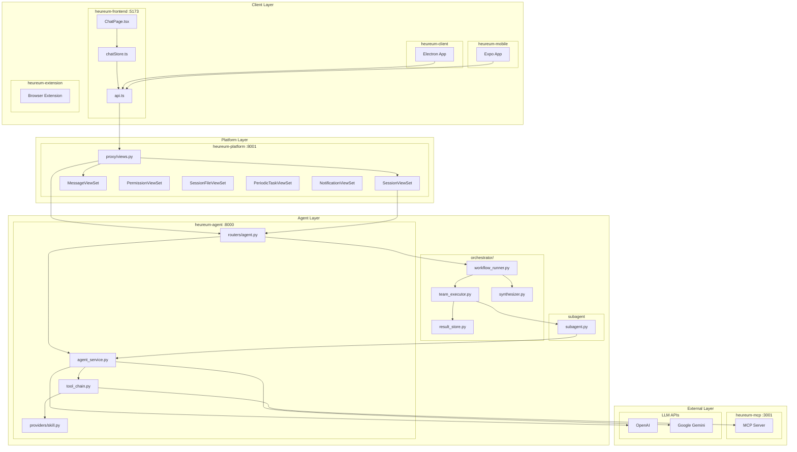
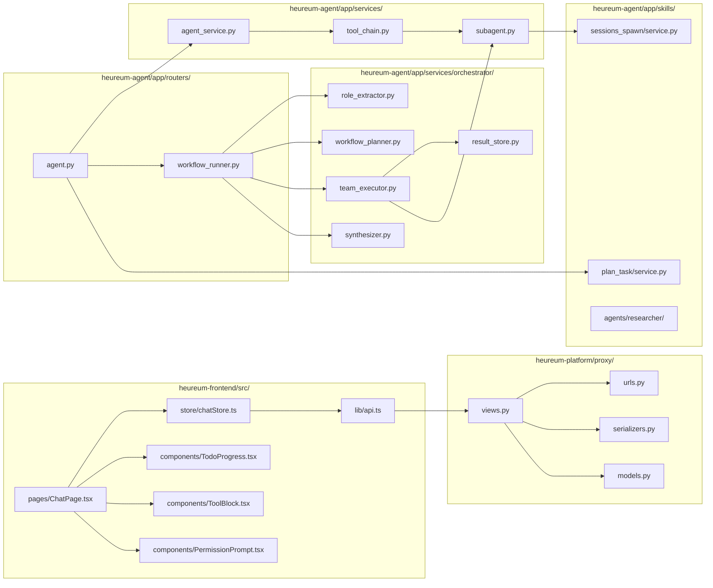
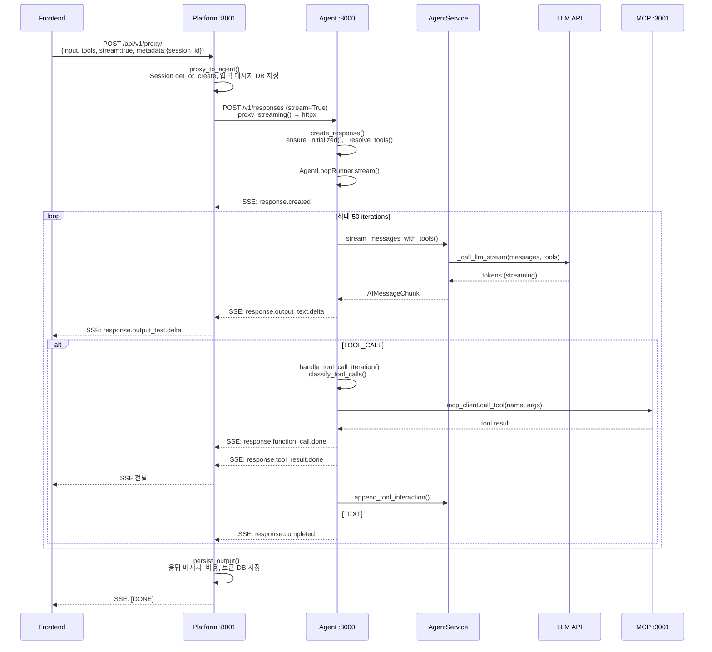
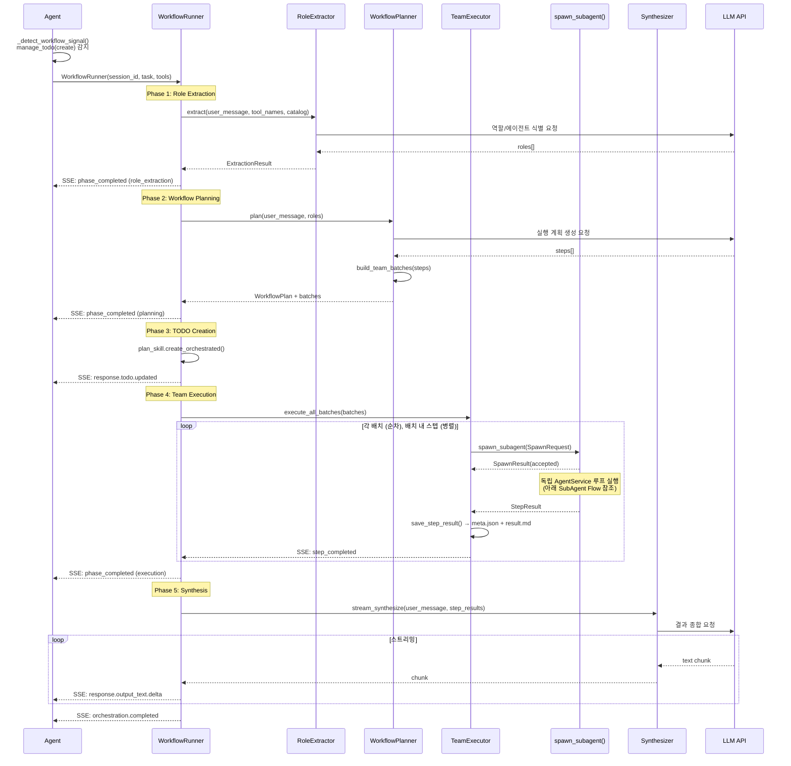
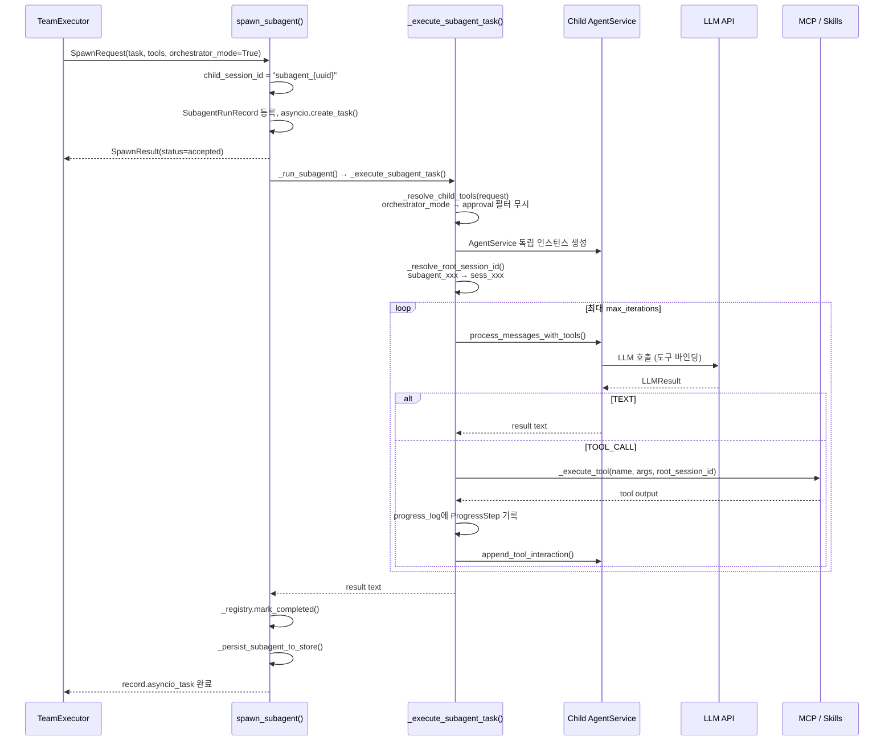
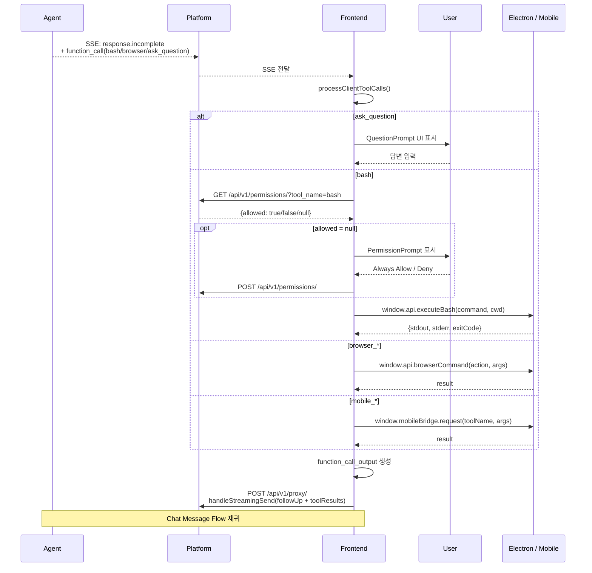
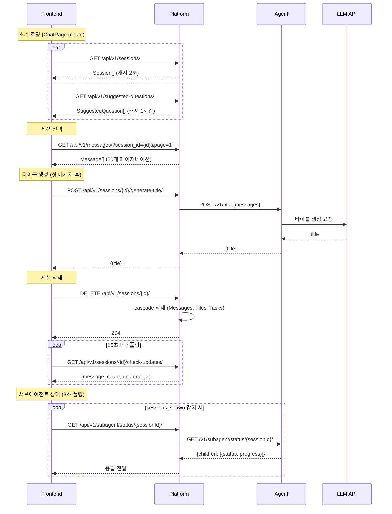

# Heureum Agent Platform

> Full-stack AI agent platform with tool-calling capabilities — Frontend(React), Platform(Django), Agent(FastAPI), MCP Server.

---

## Table of Contents

- [Project Structure](#project-structure)
- [Module Detail](#module-detail)
- [Request Flow](#request-flow)
  - [Chat Message Flow](#chat-message-flow)
  - [Workflow Orchestration Flow](#workflow-orchestration-flow)
  - [SubAgent Execution Flow](#subagent-execution-flow)
  - [Client Tool Execution Flow](#client-tool-execution-flow)
  - [Session Management Flow](#session-management-flow)
- [Module Description](#module-description)
- [API Reference](#api-reference)
  - [Endpoints Overview](#endpoints-overview)
  - [HTTP Response Codes](#http-response-codes)
  - [Endpoint Schemas](#endpoint-schemas)
- [Workflow Artifact Storage](#workflow-artifact-storage)

---

## Project Structure



---

## Module Detail



---

## Request Flow

### Chat Message Flow



---

### Workflow Orchestration Flow

`manage_todo(action: "create")` 도구 호출이 감지되면 트리거.



---

### SubAgent Execution Flow



---

### Client Tool Execution Flow

서버가 `status=incomplete` + 도구 호출을 반환하면 프론트엔드에서 실행.



---

### Session Management Flow



---

## Module Description

### Frontend (`heureum-frontend/src/`)

| File | Description |
|:-----|:------------|
| `pages/ChatPage.tsx` | 메인 채팅 페이지 — 메시지 전송, 도구 실행, SSE 이벤트 처리 |
| `store/chatStore.ts` | Zustand 상태 관리 — messages, session, streaming, todo |
| `lib/api.ts` | API 클라이언트 — 모든 HTTP/SSE 엔드포인트 정의, 도구 빌드 |
| `components/TodoProgress.tsx` | 워크플로우 스텝 진행 상황 표시 (ToolBlock 패턴) |
| `components/ToolBlock.tsx` | 도구 호출 결과 토글 UI (dot + action + chevron) |
| `components/PermissionPrompt.tsx` | 도구 실행 권한 요청 다이얼로그 |

### Platform (`heureum-platform/`)

| File | Description |
|:-----|:------------|
| `proxy/views.py` | Agent 프록시 — 메시지 저장, SSE 스트리밍 중계, 비용 계산 |
| `proxy/urls.py` | URL 라우팅 — `/api/v1/` 하위 모든 엔드포인트 |
| `proxy/models.py` | DB 모델 — Session, Message, Response, ToolPermission, SessionFile |
| `proxy/serializers.py` | DRF 시리얼라이저 — 요청/응답 검증 |

### Agent Router (`heureum-agent/app/routers/`)

| File | Description |
|:-----|:------------|
| `agent.py` | 메인 에이전트 루프 — `/v1/responses`, `_AgentLoopRunner`, 도구 실행 |
| `workflow_runner.py` | 워크플로우 파이프라인 — 5단계 오케스트레이션 (역할→계획→TODO→실행→합성) |

### Agent Service (`heureum-agent/app/services/`)

| File | Description |
|:-----|:------------|
| `agent_service.py` | LLM 호출 — 도구 바인딩, 스트리밍, 컨텍스트 압축, 모델 폴백 |
| `tool_chain.py` | 도구 레지스트리 — MCP/Skill 도구 탐색 및 실행 분배 |
| `subagent.py` | 서브에이전트 — 독립 에이전트 생성, 실행, 레지스트리 관리 |

### Orchestrator (`heureum-agent/app/services/orchestrator/`)

| File | Description |
|:-----|:------------|
| `role_extractor.py` | Phase 1 — 사용자 요청에서 필요한 역할/에이전트 식별 |
| `workflow_planner.py` | Phase 2 — 단계별 실행 계획 생성, 배치 구성 |
| `team_executor.py` | Phase 4 — 배치 순차/스텝 병렬 실행, 서브에이전트 스폰 |
| `synthesizer.py` | Phase 5 — 모든 스텝 결과를 종합하여 최종 답변 생성 |
| `result_store.py` | 파일 저장 — prompt.md, result.md, meta.json 관리 |

### Skills (`heureum-agent/app/skills/`)

| File | Description |
|:-----|:------------|
| `plan_task/service.py` | TODO 관리 스킬 — create, update, complete 상태 관리 |
| `sessions_spawn/service.py` | 서브에이전트 스폰 스킬 — orchestrator_mode 전파 |
| `agents/researcher/` | 리서처 에이전트 스킬 — 웹 검색 + 정보 수집 |

---

## API Reference

### Endpoints Overview

| Endpoint | Method | Description |
|:---------|:------:|:------------|
| `/api/v1/proxy/` | `POST` | 메시지 전송 (SSE 스트리밍) |
| `/api/v1/sessions/` | `GET` | 세션 목록 조회 |
| `/api/v1/sessions/{id}/` | `DELETE` | 세션 삭제 |
| `/api/v1/sessions/{id}/generate-title/` | `POST` | 세션 타이틀 자동 생성 |
| `/api/v1/sessions/{id}/check-updates/` | `GET` | 세션 업데이트 폴링 |
| `/api/v1/sessions/{id}/cwd/` | `PATCH` | 작업 디렉토리 설정 |
| `/api/v1/messages/` | `GET` | 메시지 조회 (페이지네이션) |
| `/api/v1/subagent/status/{id}/` | `GET` | 서브에이전트 상태 조회 |
| `/api/v1/sessions/{id}/files/` | `GET` | 세션 파일 목록 |
| `/api/v1/sessions/{id}/files/` | `POST` | 파일 업로드 |
| `/api/v1/sessions/{id}/files/{fid}/` | `PUT` | 파일 내용 수정 |
| `/api/v1/sessions/{id}/files/{fid}/` | `DELETE` | 파일 삭제 |
| `/api/v1/sessions/{id}/files/{fid}/download/` | `GET` | 파일 다운로드 |
| `/api/v1/permissions/` | `GET` | 도구 권한 확인 |
| `/api/v1/permissions/` | `POST` | 도구 권한 설정 |
| `/api/v1/permissions/log/` | `POST` | 권한 결정 로그 기록 |
| `/api/v1/periodic-tasks/` | `GET` | 정기 작업 목록 |
| `/api/v1/periodic-tasks/{id}/pause/` | `POST` | 정기 작업 일시중지 |
| `/api/v1/periodic-tasks/{id}/resume/` | `POST` | 정기 작업 재개 |
| `/api/v1/notifications/register-device/` | `POST` | 푸시 알림 디바이스 등록 |
| `/api/v1/notifications/` | `GET` | 알림 목록 조회 |
| `/api/v1/notifications/{id}/read/` | `POST` | 알림 읽음 처리 |
| `/api/v1/suggested-questions/` | `GET` | 추천 질문 목록 |

### HTTP Response Codes

| Code | Error Type | Description |
|:----:|:-----------|:------------|
| `200` | - | Success |
| `201` | - | Created (권한 설정, 파일 업로드) |
| `204` | - | No Content (삭제 성공) |
| `400` | `invalid_request` | 잘못된 요청 파라미터 |
| `404` | `not_found` | 리소스 없음 (세션, 파일) |
| `502` | `agent_service_error` | Agent 서비스 통신 실패 |
| `500` | `internal_error` | 내부 서버 오류 |

---

### Endpoint Schemas

### POST `/api/v1/proxy/`

메인 채팅 엔드포인트. 사용자 메시지를 Agent에 전달하고 SSE 스트리밍 응답을 반환.

<details>
<summary><strong>Example: Basic Message</strong></summary>

```bash
curl -X POST http://localhost:8001/api/v1/proxy/ \
  -H "Content-Type: application/json" \
  -H "X-CSRFToken: {token}" \
  --cookie "sessionid=..." \
  -d '{
    "input": [{"role": "user", "content": [{"type": "input_text", "text": "안녕하세요"}]}],
    "stream": true,
    "metadata": {"session_id": "sess_abc123"}
  }'
```

</details>

<details>
<summary><strong>Example: With Client Tools</strong></summary>

```bash
curl -X POST http://localhost:8001/api/v1/proxy/ \
  -H "Content-Type: application/json" \
  -d '{
    "input": [{"role": "user", "content": [{"type": "input_text", "text": "현재 디렉토리 파일 목록 보여줘"}]}],
    "tools": [{"type": "function", "name": "bash", "description": "...", "parameters": {...}}],
    "stream": true,
    "metadata": {"session_id": "sess_abc123"}
  }'
```

</details>

#### Request Body

```json
{
  "input": [
    {
      "role": "user",
      "content": [{"type": "input_text", "text": "메시지 내용"}]
    }
  ],
  "tools": [],
  "stream": true,
  "metadata": {
    "session_id": "sess_abc123"
  }
}
```

#### Parameters

| Field | Type | Required | Default | Description |
|:------|:----:|:--------:|:-------:|:------------|
| `input` | string \| array | Yes | - | 사용자 메시지 (문자열 또는 Open Responses 형식) |
| `tools` | array | No | `[]` | 클라이언트 도구 정의 (bash, browser 등) |
| `stream` | bool | No | `false` | SSE 스트리밍 활성화 |
| `metadata.session_id` | string | No | auto | 세션 ID (없으면 자동 생성) |

#### SSE Event Types

| Event | Description |
|:------|:------------|
| `response.created` | 응답 시작, session_id 포함 |
| `response.output_text.delta` | 텍스트 스트리밍 청크 |
| `response.output_text.done` | 텍스트 완료 |
| `response.function_call.done` | 서버 도구 호출 완료 |
| `response.tool_result.done` | 도구 실행 결과 |
| `response.todo.updated` | 워크플로우 TODO 상태 변경 |
| `response.completed` | 응답 정상 완료 |
| `response.incomplete` | 클라이언트 도구 실행 필요 |
| `response.failed` | 오류 발생 |

---

### GET `/api/v1/sessions/`

현재 사용자의 세션 목록 조회.

**Request:**
```bash
curl http://localhost:8001/api/v1/sessions/ \
  --cookie "sessionid=..."
```

**Response:**
```json
[
  {
    "session_id": "sess_abc123",
    "title": "React 컴포넌트 리팩토링",
    "created_at": "2026-02-20T10:00:00Z",
    "updated_at": "2026-02-20T11:30:00Z",
    "message_count": 24,
    "total_tokens": 15840,
    "total_cost": 0.0523,
    "has_periodic_task": false,
    "cwd": "/Users/user/project"
  }
]
```

---

### GET `/api/v1/messages/`

세션 메시지 조회 (페이지네이션).

**Request:**
```bash
curl "http://localhost:8001/api/v1/messages/?session_id=sess_abc123&ordering=-created_at&page=1" \
  --cookie "sessionid=..."
```

#### Parameters

| Field | Type | Required | Default | Description |
|:------|:----:|:--------:|:-------:|:------------|
| `session_id` | string | No | - | 세션 ID 필터 |
| `role` | string | No | - | 역할 필터 (user/assistant/system) |
| `ordering` | string | No | `created_at` | 정렬 (앞에 `-` 붙이면 역순) |
| `page` | int | No | `1` | 페이지 번호 (50개 단위) |

**Response:**
```json
{
  "count": 24,
  "next": "http://localhost:8001/api/v1/messages/?page=2",
  "previous": null,
  "results": [
    {
      "id": 1,
      "session_id": "sess_abc123",
      "role": "user",
      "content": "안녕하세요",
      "created_at": "2026-02-20T10:00:00Z"
    }
  ]
}
```

---

### POST `/api/v1/sessions/{id}/generate-title/`

LLM을 사용하여 세션 타이틀 자동 생성.

**Request:**
```bash
curl -X POST http://localhost:8001/api/v1/sessions/sess_abc123/generate-title/ \
  --cookie "sessionid=..."
```

**Response:**
```json
{
  "title": "React 컴포넌트 리팩토링 논의"
}
```

---

### GET `/api/v1/sessions/{id}/check-updates/`

세션 업데이트 경량 폴링.

**Request:**
```bash
curl http://localhost:8001/api/v1/sessions/sess_abc123/check-updates/ \
  --cookie "sessionid=..."
```

**Response:**
```json
{
  "session_id": "sess_abc123",
  "message_count": 24,
  "updated_at": "2026-02-20T11:30:00Z"
}
```

---

### PATCH `/api/v1/sessions/{id}/cwd/`

세션 작업 디렉토리 설정.

**Request:**
```bash
curl -X PATCH http://localhost:8001/api/v1/sessions/sess_abc123/cwd/ \
  -H "Content-Type: application/json" \
  -d '{"cwd": "/Users/user/project"}'
```

**Response:**
```json
{
  "session_id": "sess_abc123",
  "cwd": "/Users/user/project"
}
```

---

### GET `/api/v1/subagent/status/{session_id}/`

서브에이전트 상태 조회 (워크플로우 오케스트레이션).

**Request:**
```bash
curl http://localhost:8001/api/v1/subagent/status/sess_abc123/ \
  --cookie "sessionid=..."
```

**Response:**
```json
{
  "children": [
    {
      "child_session_id": "subagent_a1b2c3d4e5f6",
      "task": "React 컴포넌트 분석",
      "status": "running",
      "elapsed_seconds": 12.5,
      "current_iteration": 3,
      "step_name": "analyze_components",
      "progress": [
        {"tool_name": "mcp_web__search", "detail": "React best practices 2026", "status": "completed"},
        {"tool_name": "file_write", "detail": "analysis.md", "status": "running"}
      ]
    },
    {
      "child_session_id": "subagent_f6e5d4c3b2a1",
      "task": "테스트 코드 작성",
      "status": "completed",
      "elapsed_seconds": 45.2,
      "result_summary": "5개 테스트 케이스 작성 완료..."
    }
  ]
}
```

---

### GET `/api/v1/permissions/`

도구 실행 권한 확인.

**Request:**
```bash
curl "http://localhost:8001/api/v1/permissions/?client_id=electron_1&tool_name=bash&command=ls" \
  --cookie "sessionid=..."
```

**Response:**
```json
{
  "allowed": true
}
```

| Value | Description |
|:------|:------------|
| `true` | 자동 허용 (Always Allow 설정됨) |
| `false` | 자동 거부 |
| `null` | 미등록 — 사용자에게 권한 요청 필요 |

---

### POST `/api/v1/permissions/`

도구 실행 권한 설정 (Always Allow / Deny).

**Request:**
```bash
curl -X POST http://localhost:8001/api/v1/permissions/ \
  -H "Content-Type: application/json" \
  -d '{
    "client_id": "electron_1",
    "tool_name": "bash",
    "command": "ls",
    "allowed": true
  }'
```

#### Parameters

| Field | Type | Required | Description |
|:------|:----:|:--------:|:------------|
| `client_id` | string | Yes | 클라이언트 식별자 |
| `tool_name` | string | Yes | 도구 이름 (bash, browser_navigate 등) |
| `command` | string | Yes | 기본 명령어 |
| `allowed` | bool | Yes | 허용 여부 |

**Response:**
```json
{
  "id": 1,
  "client_id": "electron_1",
  "tool_name": "bash",
  "command": "ls",
  "allowed": true
}
```

---

### POST `/api/v1/permissions/log/`

권한 결정 감사 로그 기록.

**Request:**
```bash
curl -X POST http://localhost:8001/api/v1/permissions/log/ \
  -H "Content-Type: application/json" \
  -d '{
    "session_id": "sess_abc123",
    "client_id": "electron_1",
    "tool_name": "bash",
    "command": "rm -rf node_modules",
    "base_command": "rm",
    "decision": "allow_once",
    "call_id": "call_xyz"
  }'
```

#### Parameters

| Field | Type | Required | Description |
|:------|:----:|:--------:|:------------|
| `session_id` | string | Yes | 세션 ID |
| `client_id` | string | Yes | 클라이언트 식별자 |
| `tool_name` | string | Yes | 도구 이름 |
| `command` | string | Yes | 실행 명령어 전문 |
| `base_command` | string | Yes | 기본 명령어 |
| `decision` | enum | Yes | `always_allow`, `allow_once`, `deny`, `auto_approved` |
| `call_id` | string | Yes | 도구 호출 ID |

**Response:**
```json
{
  "id": 42,
  "permission_id": 1
}
```

---

### Session Files

#### GET `/api/v1/sessions/{id}/files/`

세션 파일 목록 조회.

**Request:**
```bash
curl http://localhost:8001/api/v1/sessions/sess_abc123/files/ \
  --cookie "sessionid=..."
```

**Response:**
```json
[
  {
    "id": 1,
    "filename": "analysis.md",
    "path": "analysis.md",
    "size": 2048,
    "content_type": "text/markdown",
    "created_at": "2026-02-20T10:30:00Z"
  }
]
```

#### POST `/api/v1/sessions/{id}/files/`

파일 업로드 (multipart/form-data).

```bash
curl -X POST http://localhost:8001/api/v1/sessions/sess_abc123/files/ \
  -F "file=@document.pdf"
```

#### POST `/api/v1/sessions/{id}/files/write/`

에이전트 도구를 통한 파일 저장 (MCP 내부 사용).

```bash
curl -X POST http://localhost:8001/api/v1/sessions/sess_abc123/files/write/ \
  -H "Content-Type: application/json" \
  -d '{
    "path": "output/result.md",
    "content": "# 분석 결과\n..."
  }'
```

---

### Periodic Tasks

#### GET `/api/v1/periodic-tasks/`

정기 작업 목록 조회.

**Request:**
```bash
curl http://localhost:8001/api/v1/periodic-tasks/ \
  --cookie "sessionid=..."
```

**Response:**
```json
[
  {
    "id": 1,
    "session_id": "sess_abc123",
    "task_prompt": "매일 아침 뉴스 요약",
    "schedule": "0 9 * * *",
    "status": "active",
    "last_run_at": "2026-02-20T09:00:00Z",
    "next_run_at": "2026-02-21T09:00:00Z"
  }
]
```

#### POST `/api/v1/periodic-tasks/{id}/pause/`

```bash
curl -X POST http://localhost:8001/api/v1/periodic-tasks/1/pause/
```

#### POST `/api/v1/periodic-tasks/{id}/resume/`

```bash
curl -X POST http://localhost:8001/api/v1/periodic-tasks/1/resume/
```

---

### Notifications

#### POST `/api/v1/notifications/register-device/`

푸시 알림 디바이스 등록.

```bash
curl -X POST http://localhost:8001/api/v1/notifications/register-device/ \
  -H "Content-Type: application/json" \
  -d '{"token": "fcm_token_xxx", "device_type": "web"}'
```

#### GET `/api/v1/notifications/`

알림 목록 조회.

```bash
curl "http://localhost:8001/api/v1/notifications/?unread=1" \
  --cookie "sessionid=..."
```

**Response:**
```json
[
  {
    "id": 1,
    "title": "정기 작업 완료",
    "body": "매일 아침 뉴스 요약이 완료되었습니다.",
    "read": false,
    "created_at": "2026-02-20T09:05:00Z"
  }
]
```

#### POST `/api/v1/notifications/{id}/read/`

```bash
curl -X POST http://localhost:8001/api/v1/notifications/1/read/
```

#### POST `/api/v1/notifications/read-all/`

```bash
curl -X POST http://localhost:8001/api/v1/notifications/read-all/
```

---

## Workflow Artifact Storage

워크플로우 실행 시 각 스텝의 프롬프트, 결과, 메타데이터가 파일시스템에 저장됨.

```
heureum-platform/media/sessions/{session_id}/
├── workflow.json              # WorkflowPlan 전체 계획
├── steps/
│   └── {step_name}/
│       ├── meta.json          # status, duration_ms, assigned_agent, task
│       ├── prompt.md          # 에이전트에 주입된 시스템 프롬프트 전문
│       ├── result.md          # 에이전트 출력 결과
│       └── subagents/         # 서브-서브에이전트 (선택적)
│           └── {child_id}/
│               ├── meta.json
│               └── result.md
└── synthesis.md               # 최종 합성 결과
```

### meta.json Schema

```json
{
  "step_name": "analyze_components",
  "status": "completed",
  "assigned_agent": "researcher",
  "task": "React 컴포넌트 구조 분석",
  "duration_ms": 45200,
  "saved_at": "2026-02-20T11:30:00Z",
  "error": null
}
```
